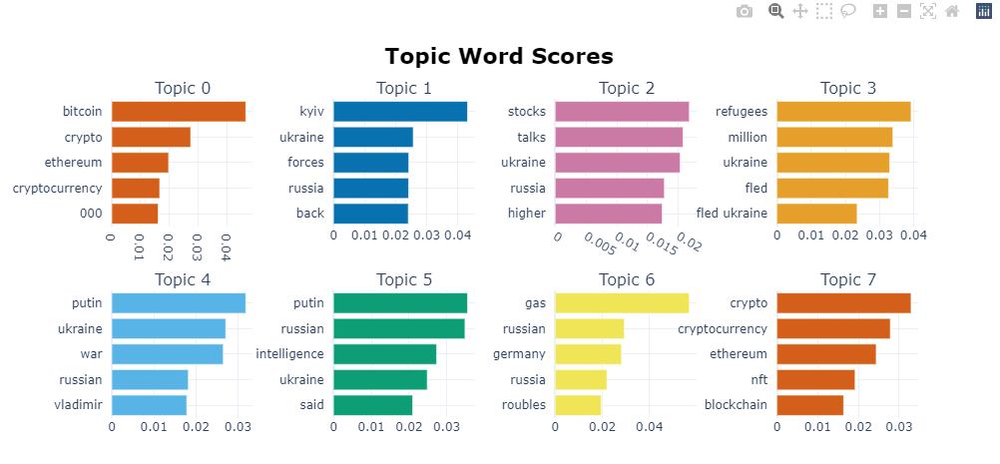
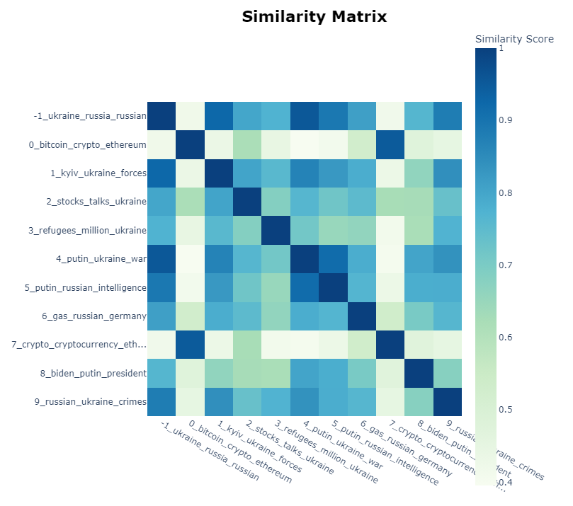
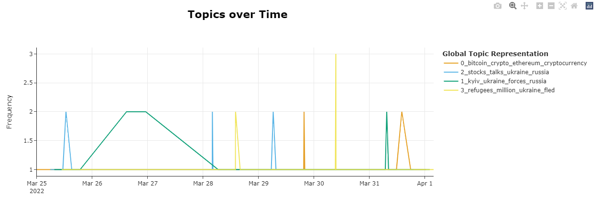
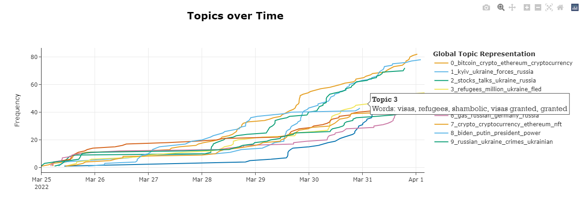

# News Trends using BERTopic

## Finding a source of news (API)

### NewsCatcher

https://docs.newscatcherapi.com/

Python API: https://docs.newscatcherapi.com/knowledge-base/guides-and-tutorials/export-news-into-a-csv-with-python

# Use BERTopic to generate themes, topics, and trends over time

---

---

---

